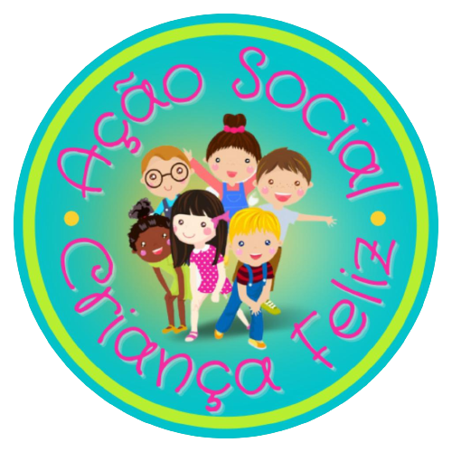

<h1 align="center">Natal Social Criança Feliz</h1>

<div align="center">
  
</div>

# Proposta

Projeto Conclusão do Curso: Turma 21 - Imersão JavaScript {Reprograma} | Dezembro 2022 | Autora: [Bárbara Pereira](https://github.com/barbara-pereira)

### Objetivo

Desenvolver uma aplicação para cadastrar padrinhos e crianças para doação de sacolinhas de Natal

### Qual problema resolver com o projeto?

Organizar e otimizar o cadastro de padrinhos e crianças para a doação de sacolinhas de Natal, de forma simplificada, facilitando a comunicação, vinculação e confirmação dos participantes

---

### Resumo

O que o sistema terá?
- [Detalhes do Projeto Social](#detalhes-do-projeto-social)
- [O que quero Resolver](#o-quero-resolver)
- [Informações Técnicas](infomações-técnicas)
  - [Classe Pessoa](#classe-pessoa)
  - [Classe Padrinho](#classe-padrinhes)  
  - [Classe Criança](#classe-crinaça)
- [Evolução do Projeto](evolução-d-projeto)
- [Objetivo final](#objetivo-final)

 
## Detalhes do Projeto Social

Nosso [Projeto Social Criança Feliz]("https://www.instagram.com/criancafeliz.as/) começou através da iniciativa da minha irmã de religião [Catia]("https://www.instagram.com/catia_520/") ao saber que sua mãe quando criança não tinha um Natal de qualidade por não ter condições financeiras. Assim como sua mãe, a Catia por muitas vezes não ganhava um presente de Natal e isso a fez refletir quanto isso é importante para uma criança e esse lúdico nós não podemos deixar morrer. Observando a nossa volta, no nosso próprio bairro, quantas crianças mais não podem viver esse sonho. 
E assim, começamos a materializar o nosso sonho e pouco a pouco juntando padrinhos, madrinhas e cada vez com mais e mais crianças, nosso projeto cresceu, floresceu e ao longo desses doze anos, temos nossas crianças como parte da nossa família.
As crianças e suas famílias possuem alguns requisitos para participar do cadastramentos, como por exemplo ter um bom relacionamento com os estudos, o que é fundamental.
 

## O que quero resolver

Este projeto está sendo desenvolvido com ambito social, buscando otimizar o tempo em realizar o víncilo entre pessoas que desejam realizar doações e com crianças que desejam receber um presente para tornar o Natal mais feliz.
A dificldade atualmente está em otimizar a lista de padrinhos e crianças, podendo centralizar as informações em um local e realizar consultas e filtos para buscar informações especíicas.


## Informações Técnicas

 Para rodar este projeto, será necessário instalar:
 - [Visual Studio Code]("https://code.visualstudio.com/download"): editor de código para exercutar a aplicação 
 - [Node]("https://docs.npmjs.com/downloading-and-installing-node-js-and-npm"): uma tecnologia usada para executar código JavaScript fora do navegador
 - [Jest]("https://jestjs.io/docs/getting-started"): para rodar os testes unitários

### Classe Pessoa
A Classe Pessoa foi criada para ser um modelo de forma generica, com informações básicas que precisamos que uma pessoa tenha na nossa aplicação,  recebendo como parâmetro: **id, nomeCompleto e contato.**. A clase Pessoa foi criada para evitar repetição de código.
  - **ID:** O id está sendo gerado de forma dinâmica, para que cada pessoa existente tenha uma identificação única. A função **returnId** está gerando randomicamente um valor entre 0 e 999  
  ```javascript
  
function returnId(){
  return (Math.random()*1000).toFixed(0);
}

  ```

- **listaParticipante:** O Atributo estático recebe um objeto composto por 2 elementos, sendo eles: um array para armazenar o objeto criança, ou seja, recebe todas as instâncias de crianças. O mesmo acontece ao instanciar um padrinho, sendo armazenado no array padrinhos.

 ```javascript
  
static listaParticipante = {
      criancas: [],
      padrinhos: []
    }  

  ```
  
### Classe Padrinho
A Classe Padrinho será extendida da Classe Pessoa. Além das informações recebida da Classe Pessoa, receberá como atributo **escolherGenero** onde o padrinho, ao realizar o cadastro, informará qual o gênero da criança que deseja apadrinhar.

No construtor, eu invoco o método estático contido na classe Pessoa, para que quando eu cria um novo padrinho, o mesmo seja adicionado no array de padrinhos, conforme o exemplo a seguir:
```javascript
  Pessoa.listaParticipante.padrinhos.push(this);
```

### Classe Crianca
Ja na Classe Crianca, alem dos dados herdados de Pessoa, receberá os atributos: **nomeDoResponsavel, idade, genero, tamanhoRoupa, tamanhoSapato**, onde irão complementar o cadastro com informações da criança e dados para contato com o responável.

No construtor, eu invoco o método estático contido na classe Pessoa, para que quando eu cria um nova criança, o mesmo seja adicionado no array de crianças, conforme o exemplo a seguir:
```javascript
  Pessoa.listaParticipante.criancas.push(this);
```

- **vincularPadrinho:** É o método responsável por vincular um padrinho à uma criança. 
O método inicia verificando se o atributo padrinhoCadastrado criado na classe Criança é diferente de vazio, se for verdadeiro, a criança já possui um padrinho vinculado.
Se não entrar na primeira validação, é executava uma nova validação, onde verifica se o atributo estático de padrinho não está vazio, caso preenchido, verifica no na informação do padrinho qual o gênero da criança que o padrinho deseja e vincula com a criança do mesmo gênero.
```javascript
vincularPadrinho() {
    if (this.padrinhoCadastrado.length != 0) {
        console.log("a criança já possui um padrinho");
    } else {
        if (Pessoa.listaParticipante.padrinhos.length != 0) {
            const padrinhoGenero = Pessoa.listaParticipante.padrinhos.filter((p) => p.escolherGenero === this.genero);
            Pessoa.listaParticipante.padrinhos.splice(padrinhoGenero[0], 1)
            return this.padrinhoCadastrado.push(padrinhoGenero[0]);
        }
        else {
            console.log("Precisa cadastrar um padrinho");
        }
    }
```

## Evolução do Projeto
Visando melhorias futuras, mapeei alguns pontos que poderão ser aplicados
  - criar os atibutos privados
  - traduzir o código para inglês
  - validar o campo contato com regex
  - criar mpetodos de editar informação e excluir informação
  - exportar os dados em excel
  - integrar o código com o html
  - hospedar a página
  - armazenar os dados em um banco de dados


## Objetivo final:
Ter a aplicação completa para ser usada no cadastro de sacolinhas do Natal de 2023


 ### Contatos da [Bárbara Pereira](https://github.com/barbarapereira)
 <br>

 <a href = "mailto:barbara.pereira1990@gmail.com">   </a>

  <a href="https://www.linkedin.com/in/barbara-frontend-developer" target="_blank"></a> 
